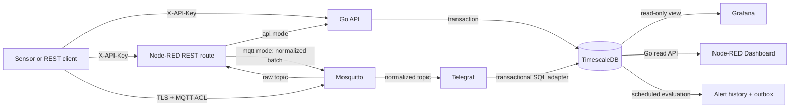

# Architecture and data flow

DanuBaaS separates transport, validation, persistence, and presentation. The Go
API is the public contract for immutable observations. Node-RED demonstrates a
gateway workflow; Mosquitto and Telegraf provide an alternate database write
adapter. Both routes reach the same TimescaleDB tables and dashboards.

## Storage model

Each observation has a client-generated UUID and canonical JSON. The API writes a
registry row in `sensor.events` and queryable fields in the Timescale hypertable
`sensor.measurements` in one transaction. The registry enforces global ID
uniqueness; `sensor.dashboard_values` gives Grafana a read-only reporting view.
An identical UUID and content is a replay; altered content is a conflict.
Observations have no update or delete endpoint.

The MQTT adapter inserts through `sensor.mqtt_ingest`, whose trigger validates a
whole document and writes the same tables. The staging table stays empty. Invalid
documents and ID conflicts are recorded in `sensor.rejected_messages` for
operational inspection; other SQL failures are left retryable. API and MQTT writers
share sequence allocation so pagination can traverse commits without skipping a
delayed writer. The system makes a deliberate throughput tradeoff for this demo.

Migrations are versioned and run explicitly by `sensor-api migrate`. The HTTP
process has no schema DDL privileges. See the
[schema migration sources](https://github.com/AndreasWillibaldWeber/DanuBaaS/tree/main/internal/postgres/migrations).

## Write route semantics

| Entry point | Success means | Client action |
| --- | --- | --- |
| Go API, or Node-RED in `api` mode | `201` means committed; `200` means identical replay | Keep the UUID on retry |
| Node-RED in `mqtt` mode | `202` means broker acknowledgment | Poll GET until the UUID is visible; retain it on retry |

Only Node-RED publishes normalized MQTT batches. The demo does not fan a request
out to both writers. MQTT transport uses TLS and topic ACLs. The SQL adapter
accepts only its restricted Telegraf role. The direct Go API remains a read and
write endpoint in both modes. The [deployment source guide](https://github.com/AndreasWillibaldWeber/DanuBaaS/blob/main/deploy/README.md#select-the-node-red-write-route)
contains route switching and upgrade details.

## Alerts and presentation

PostgreSQL evaluates water-level rules on a TimescaleDB scheduled job. It records
state transitions, observation evidence, acknowledgments, and a notification
outbox. The Go API serves alert history and administration; Grafana shows active
alerts and evaluator status. Only canonical `sensor_type="water-level"`, `unit="m"`
observations can drive these rules. See [alert semantics](alerting.md) and the
[monitoring dashboard](monitoring-dashboard.md).
