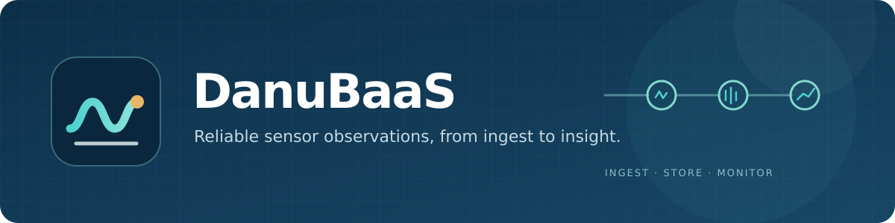

# DanuBaaS

{ .hero-banner }

DanuBaaS is a self-hosted sensor backend for immutable observations. A Go HTTP API
accepts and reads sensor values, while a selectable Node-RED route ingests through
the API or Mosquitto and Telegraf. TimescaleDB stores the observations; Grafana and
Node-RED show committed data. PostgreSQL evaluates configured water-level alerts.

The development stack runs with one command:

```sh
git clone https://github.com/AndreasWillibaldWeber/DanuBaaS.git
cd DanuBaaS
make dev
```

Read the [quick start](getting-started.md) before opening the local dashboards.
For a complete synthetic demonstration with populated charts and verified alerts,
use `make dev-test-data`.

## Choose your path

| If you want to… | Start here |
| --- | --- |
| Run the complete local stack | [Quick start](getting-started.md) |
| Submit or page through observations | [Observation API](api.md) and [OpenAPI specification](openapi.md) |
| Understand the two write routes | [Architecture and data flow](architecture.md) |
| Configure thresholds and read alert history | [Water-level alerts](alerting.md) |
| Prepare a deployment | [Deployment and operations](operations.md) and [security model](security.md) |
| Verify behavior before a release | [Quality strategy](quality.md) and [end-to-end verification](end-to-end-testing.md) |

## What the system guarantees

Direct API writes commit before the API returns `201`. Identical retries preserve
the original observation; a changed payload under the same ID conflicts. A batch
is atomic. List reads use a bounded cursor in commit order. The Node-RED MQTT mode
returns `202` after broker acknowledgment, so clients must poll for read visibility.
These two responses have different delivery meanings; see the
[architecture guide](architecture.md#write-route-semantics).

This is a demonstrator for authenticated sensor ingestion, retrieval, dashboards,
and configurable threshold alerts. Its example water-level parameters are
synthetic. It does not claim validated flood prediction or high availability.
